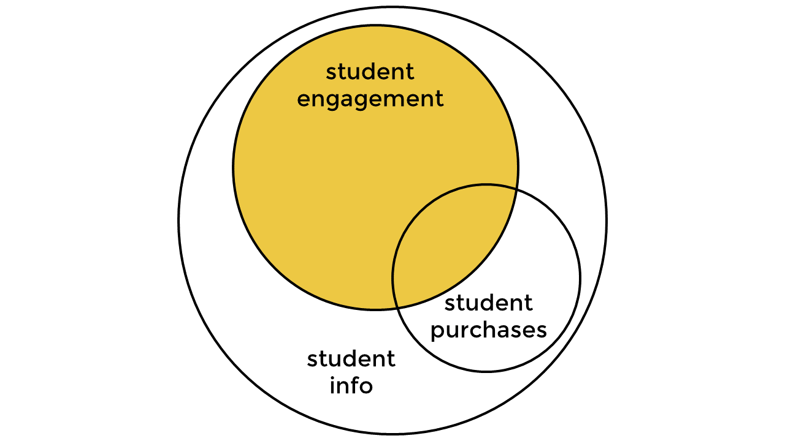
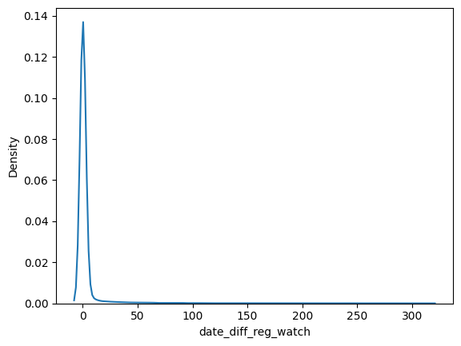
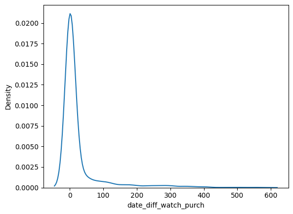

# Free-To-Paid Conversion Rate

## Introduction

 [365datascience](https://learn.365datascience.com) is an online platform with 3M+ students that provides data science, machine learning, and AI training. This [project](https://365datascience.com/projects/calculating-free-to-paid-conversion-rate-with-sql/)  consists of looking at the free-to-paid conversion rate for the marketing and sales team to analyse the effectiveness of marketing campaigns leading new visitors to the website and purchasing subscriptions.

This is a demonstration of utilising tools such as:
- SQL
- Python

## Problem Statement

The questions posed by 365datascience are:
- What is the free-to-paid convertion rate? In other words what is the ratio of students who purchase a subscription after watching a video to students who have watched a video.
- What is the average time (days) between a student registering to the website and watching their first educational video.
- What is the average time (days) between a student watching their first video and purchasing a subscription.

## Data Source

The data is an excerpt from 365datascience's own data, stripped of personally identifiable information. 

## Data Transformation

The database consists of three table: student info, student engagement and student purchases. An SQL subquery joins the relevant data as shown in the venn diagram. Furthemore two additional columns are added consisting of 
1. Days between registration and first watched video - (date_diff_reg_watch).
2. Days between first watched video and subscription purchase - (date_diff_watch_purch).

Furthermore, aggregate functions are used in the main query to calculate 
1) Free-to-paid conversion rate.
2) Average time (days) between registration and watching a video.
3) Average time (days) between first watched video and purchasing a subscription.

## Data Analysis and Visualisation

In this subsection we will look at several statisticl metrics either obtained above or when combined with python. 

### Conversion Rate

The first metric we can observe is one obtained from the above analysis: free-to-paid conversion rate. We find the percentage of students who pay for a subscription after watching a lecture is 11.29%. This means roughly 11 people sign up for a subscription for every 100 people coming to the platform. 

This value can be quite difficult to gauge and compare to the average industry conversion rate without a deeper knowlege of the industry. A benchmark for educational apps suggest 34.4% and 18.1% conversion rate for Google Play and iOS respectively [[1]](https://www.businessofapps.com/data/education-app-benchmarks/). Furhtermore, 42.1% for eucational platform subscription conversion rates in 2022 [[2]](https://www.statista.com/statistics/1419664/subscription-commerce-conversion-rate-vertical/). In comparison to these references, a conversion rate of 11.3% for 365datascience is significantly lower. What could be some reasons for this?

- Perhaps the targeted audience are a broad range of students and not only those interested in data science. Thus, we have a larger audience who come to the site out of curiosity.
- There could be some unwanted friction in subscribing resulting in students losing inspiration or motivation.
- Furthermore, the quality of the free videos could not be engaging enough for students deciding whether or not this is worth their time, effort, and money. Or the perception of the courses provided not worth the subscription.
- A lack of directional instructions to newcomers could be present. As a beginner, new to the field of data science, which courses to take, what languages to start learn, etc. can be overwhelming. Instructional pathways could help.
- There is still the possibility that students don't like the platform, or are waiting for discounts to be offered and continue their endeavours elsewhere.

---

A connection to SQL is achieved using the sqlalchemy package in python allowing deeper analysis of the data. The metrics we look at next are the measures of central tendancies: mode, median, and mean.

### date_diff_reg_watch
- Mode: 0.
- Mean: 3.4.
- Median: 0.

While the mean days between registering and watching a video is approximately 3, we can observe the from the plot above we have a right-skewed distribution. The median in this case is more informative and tells us the central tendency is 0 days between registering to the website and watching a lecture. However, the most frequent number of days (mode) is 0. So most people watch a lecture the same day as registering to the 365datascience website. 

### date_diff_watch_purch
- Mode: 0.
- Mean: 26.2.
- Median: 1.

Similar to the previous plot, the days between watching a lecture and signing up for a subscription is a right-skewed distribution with most audiences purchasing a subscription the same day as watching a lecture. While the mean is 26 days, it is sensitive to outliers and the median is more informative telling us the typical the number of days is actually 1 day. 

